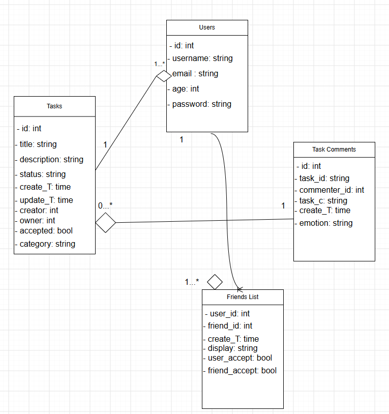
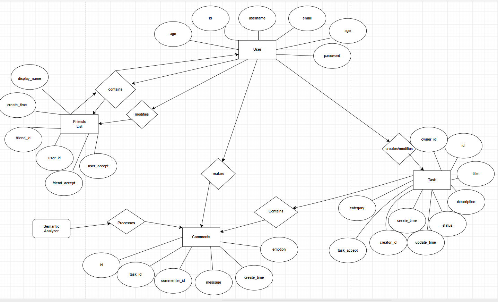

# Lively Connections

## Overview
The following app is a to-do list with social features allowing friends to make certain modifications to their friends to-do list. The app consists of a React frontend and an Express/PostgreSQL backend. Users can register, manage their tasks, as well as friends' list and comment/create tasks for their mutual friends. Features are authenticated using JWT.

## Features
- JWT Authentication
- Task Management -> CRUD operations on tasks with proper authentication
- Friend Management -> CRUD operations on friends list
    - Mutual friends are able to view and comment on their friend's task
- State Management
    - React state variables are used to filter, as well as display modals, offCanvas, and filter between tasks/categories
- Error Handling
    - Try/catch blocks when making a database query and requests from the frontend to the backend
- Deployment
    - Frontend and backend independently deployed on Render
    - https://to-do-list-front-end-yvrs.onrender.com/
    - https://to-do-list-yehb.onrender.com/
- Emotion Analysis
    - Each comment is posted to an API (Emotion Detection API) that returns a grade for the overall speech. I took the most scored emotion and then converted it to an emoji to display alongside on comment. This is intended to show someone's overall tone in a message for a particular task
- Chat Rooms
    - Users can now create rooms and invite members to join the room
- Collaborative Group Tasks
    - Members of a room can now create tasks. These tasks can be edited by anyone. Only the task owner or the room owner are able to delete the tasks.
    Only the room owner can delete categories.
- Chat Room Comments
    - Users can now leave comments on tasks within the group
- Chat Room Messaging
    - Users can now create and view messages inside a room
- Live Messaging
    - Web Socket Connections allow users to chat in real time

## Tech Stack
- Frontend: React, bootstrap (CSS)
- Backend: Express.js, Node.js
- Database: PostgreSQL
- Authentication: JWT
- Deployment: Render

## Architecture Diagram
Frontend (React/Vite) → Render (Static Hosting)
        ↓
Backend (Express.js) → Render (Web Service)
        ↓
Database (PostgreSQL) → Render Managed DB

## Security
- JWT
- Passwords hashed with bcrypt

## Testing
This project includes test suites for:
- Authentication
    - Making sure that routes are protected and JWT tokens are verified
- Tasks, Friends, Comments (CRUD operations w/ protect ed routes and permissions)
- Run all tests from 'backend-connections' with:
    - npm test

## Future Improvements
- Suggestions
    - There could be a global section where users can search by category and the tasks can be displayed by most commented

## Diagrams

## Usage: Github Repository
- https://github.com/kedwards71/To-Do-List
    - inside the directory 'backend-connections'
        - npm install
        - npm start
    - inside the directory 'frontend-connections'
        - npm install
        - npm run build
- Frontend entry point deployed on render:
    - https://to-do-list-front-end-yvrs.onrender.com/

## Env
- Each directory has their own env file
    - Frontend:
        - VITE_BACKEND
        - VITE_HOST
    - Backend:
        - PORT
        - USER
        - PASSWORD
        - DATABASE
        - DB_HOST
        - JWT_SECRET
        - API_KEY
        - HOST
        - FRONTEND

## PostgreSQL Tables

## Acknowledgments
I made this project with consultation from **Microsoft Copilot**. I had ideas of how I wanted certain things done, but lacked the knowledge on how to implement them myself. For example, I knew I wanted to have my passwords hashed, but I didn't know how to go about doing it myself, so I had copilot tell me about bcrypt. When I would run into a problem like 'AUTO_INCREMENT' not working on postgres, I asked the AI. I tried to use the AI to the best of my ability to further my learning, as well as follow industry standards.
    - Weighing pros/cons of MySQL vs PostgreSQL
    - Industry Standards
    - Debugging
    - Deployment process
Another AI agent I used was **Github Copilot** it helped me implement websocket, as well as security validation for it.